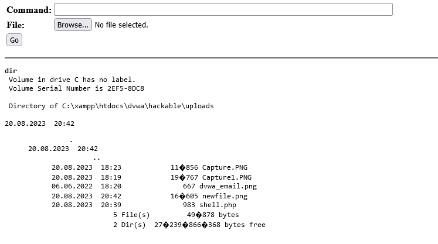

# Web-hack

### Task
 Deploy the DVWA platform.
 
 Find at least 3 vulnerabilities.
 
 develop a c99, r57 type shell.

### 1. SQL Injection
 SQL Injection (SQLi) is a type of cyber attack where malicious code is injected into a web application's input fields to manipulate or exploit its database, potentially granting unauthorized access or revealing sensitive information. This occurs due to inadequate input validation, allowing attackers to alter SQL queries and gain control over the application's database.

 Basic Injection
 
 On the SQL Injection page, we have a USER ID field. We can enter a number and it will show data related to that user.
 
  
 
 Always True Injection
 
 Enter an input like ```%' OR 1=1#``` and hit Enter. This will result in an OR that is always true and will apply the SQL statement to everything in the table.
 
  
 
 Completely different query
 
 With breaking being possible we can get it to run a completely different query for example we can get the names of all the tables in the database.
 ```%' and 1=0 union select null, table_name from information_schema.tables #```
 
  
 
 Preventing SQL injections
  
  Use Parameterized Statements (Prepared Statements): Instead of embedding user inputs directly into SQL queries, use parameterized statements provided by your programming language's database library. This ensures that user inputs are treated as values and not executable code.
  
  Input Validation: Validate and sanitize user inputs to ensure they conform to expected formats. This can prevent malicious input from being processed.
  
  Escaping Special Characters: If for some reason you can't use parameterized statements, make sure to properly escape special characters in user inputs before incorporating them into queries. This prevents them from being treated as part of the SQL code.
  
  Least Privilege Principle: Give database users only the permissions they absolutely need. This minimizes the potential damage that an attacker can cause even if they manage to perform an SQL injection.
  
  Stored Procedures: Use stored procedures whenever possible. They encapsulate database operations and can help prevent direct SQL injection by limiting what can be executed.
  
  ORMs (Object-Relational Mapping): If your application uses an ORM, it often abstracts away the direct interaction with SQL queries, reducing the risk of injection.
  
  Whitelist Input Validation: Instead of blacklisting certain characters, focus on defining a whitelist of allowed characters or patterns for inputs.
  
  Web Application Firewall (WAF): Implement a WAF to filter out malicious requests before they even reach your application.
  Regular Updates and Patching: Keep your database software, web server, and application framework up to date with the latest security patches.
  
  Security Audits and Code Reviews: Regularly review your codebase for potential vulnerabilities, including SQL injection, and conduct security audits to identify and fix issues.
  
  Limit Error Details: Avoid displaying detailed error messages to users, as they can provide attackers with valuable information about your database structure and queries.
  
  Use a Web Application Security Scanner: Utilize automated security scanning tools to identify vulnerabilities in your application, including SQL injection.

### 2. Command injection
 
 Command injection is a type of cyber attack where an attacker exploits vulnerabilities in a software application to execute unintended commands on a target system. This typically occurs when an application does not properly validate or sanitize user input before incorporating it into a command that is executed by the underlying operating system.
 
 Command injection depends on the OS as there are different commands between for example windows and linux.
 The intended use is to ping an IP so let's ping localhost ``` localhost ```
 
  
 
 Now let's inject some commands, check the directory ``` localhost && dir ```
 
  
 Basically we can run any command we want.
 
 Prevent command injection:
  
  Validate and sanitize all user inputs before using them in commands.
  
  Use whitelists to allow only specific, known safe characters or patterns.
  
  If user input must be used within a command, escape or encode the input to prevent it from being interpreted as commands.
  
  Run applications and services with the least privilege necessary to perform their tasks.
  
  Utilize security-focused libraries and frameworks that provide built-in protection against common vulnerabilities.
  
  Deploy WAFs that can detect and block malicious inputs and requests.

### 3. XSS
 Cross-Site Scripting (XSS) is a type of security vulnerability that occurs in web applications when an attacker injects malicious code (usually in the form of scripts) into a website that is then viewed by other users. This can happen when a web application doesn't properly validate or sanitize user inputs before rendering them on a webpage. As a result, the malicious code becomes part of the webpage's content and is executed by the browsers of users who visit the compromised page.

 Since we can run any code we choose, let's turn the page upside down, for that we need to edit the textarea's maxlength firs and then use the script:
 ```<script>alert(document.body.style['transform'] = 'rotate(180deg)');</script>```
 
 
 
 Now how the page looks after the script.
 
 
 
 And here we can see that the script has been inserted into the html.
 
  

 Preventig XSS attacks:
  
  Implement security headers in your web server configuration, such as the "X-XSS-Protection" header, which instructs browsers to enable their built-in XSS protection mechanisms.
  
  Always validate and sanitize user inputs on both the client and server sides. Ensure that inputs conform to expected formats and reject those that contain potentially malicious characters or scripts.
  
  Use server-side input validation to ensure that data meets expected criteria before processing it.
  
  Encode dynamic content properly before rendering it in HTML, JavaScript, or other contexts. HTML encoding converts special characters to their corresponding HTML entities, preventing them from being interpreted as code.
  
  Implement a strict Content Security Policy that specifies which sources of content are allowed to be executed on your web page. This can prevent the execution of scripts from unauthorized sources.

### 4. Php shell
 
 This PHP script allows you to execute shell commands and upload files to the server. It provides a simple web interface where you can input a command to execute and upload files to the current directory on the server.
 
 ## How to Use
  
  Access the Script: Place this script on a web server that supports PHP. You can place it in any directory where your web server can access it.
  
  Web Interface: When you access the script through a web browser, you'll see a form with two input fields:
  
  Command: Enter the shell command you want to execute. The output of the command will be displayed below the form.
  
  File: Choose a file to upload to the server. The uploaded file will be saved in the same directory as the script.
  
  Execute Commands: Enter a command in the "Command" field and click the "Go" button. The script will execute the command using shell_exec and display the output in a preformatted block.
  
  Upload Files: Choose a file using the "File" field and click the "Go" button. The script will attempt to upload the selected file to the same directory as the script. You'll receive a success or failure message after the upload.

 Upload the shell.php via ```Vulnerability: File Upload```
 
 Go to ```http://localhost/dvwa/hackable/uploads/shell.php```
 
 Mess around with the shell, and check the directory
 
  
 
 Upload and check if a new file has been added, can see ```newfile.png```
 
  
 
 Delete the new file
 
  
 
 Basically can run any commands you want.